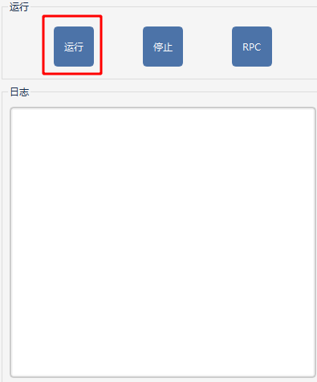

# 自动办公助手使用说明

## 工具下载

链接：https://pan.baidu.com/s/1bvbbZ1j9iw1oviu6a_F6Cg 
提取码：ckxc 

## 功能介绍

### 1.编写客户端自动化脚本

- 功能概览

  

- 使用步骤

  - 步骤一：点击新建脚本按钮

    

  - 步骤二：拖拉拽左侧的基础操作到右侧视图区域

    

  - 步骤三：填写步骤参数

    注：

    （1）clickes为鼠标点击次数；

    （2）button为选择点击的按键（鼠标左键left;鼠标右键right）；

    （3）posx和posy为鼠标所在的位置坐标（x,y），可通过截图工具获取鼠标的x,y坐标。比如整个屏幕的为1920x1080的分辨率，则左上顶点坐标为（0，   0），右上顶点坐标为（1920，0）；

    （4）el参数为按钮截图图片的文件名（不带后缀），按钮图片一定要放在AutoWorker\picture目录下。

    

  说明：第一个关键字标是鼠标在当前位置左键点击1次；第二个关键字标是鼠标在（100，100）坐标位置用鼠标左键点击1次；第三个关键字表示鼠标在login_btn.png图片位置用鼠标左键点击1次。

------

### 2.录制客户端自动化脚本

- 功能概览

  

- 使用步骤

  - 步骤一：点击录制按钮，弹出录制页面

    

  - 步骤二：设置录制精度

    录制精度表示当录制鼠标移动时的时间间隔，精度越大，鼠标移动动作的录制就越多越精细。一般这个配置默认就好，不需更改。

  - 步骤三：开始录制

    点击开始录制按钮，或者使用热键F1，开始录制我们的鼠标和键盘操作行为。

  - 步骤四：人工执行相关动作

    执行我们要录制的相关动作，这些动作都会被程序捕捉并记录下来。

  - 步骤五：结束录制

    结束录制后，脚本会自动生成，并在右侧进行展示。录制完成后我们还可以对脚本进行自定义修改（见上一个功能介绍），也可不修改直接运行。

    

------

### 3.本地运行脚本

- 功能概览

  

- 使用步骤

  - 步骤一:勾选要运行的用例

    

  - 步骤二：运行相关配置

    

  - 步骤四：点击运行

    

    点击运行后，程序会自动控制鼠标或键盘执行脚本中的动作，并在下方的日志框实时打印执行情况。

------

### 4.远程运行脚本（与大有结合）

- 功能概览

  

- 使用步骤

  - 步骤一：首先我们需要新建一个脚本

    这个参考1，2两个功能介绍

    

  - 步骤二：启动被测机器本地的RPC服务

    

  - 步骤三：大有测试工具使用post关键字发送post请求

    

    说明：发送post请求需要填写四个地方：

    第一个是url，IP和端口号为启动RPC服务的被测机器的IP和端口；

    第二个是headers，这个固定填写；

    第三个是json参数，method参数指定要远程调用的脚本名称，有两种，一种是基础脚本，如action.01鼠标当前位置点击，另一种是新建的脚本，如scripts.01我的脚本；params参数表示大有测试工具要传递给远程被测脚本的参数；jsnonrpc和id不用管，按照默认。

    第四个是result_json参数，这个参数可以获取到远程脚本的执行结果，用于对客户端自动化测试用例的断言。

  

------

### 5.数据库批量数据构造

- 功能概览

  

- 使用步骤

  该功能有两种使用方式：

  - （1）批量执行sql文件

    

  - （2）执行sql语句

------

### 6.图像识别

- 功能概览

  

- 使用步骤

  说明：该功能需要提前训练好自己要识别的图片权重，比较麻烦，可以联系工具开发者学习如何训练。该功能默认使用的是yolov5s权重，这个权重是专门识别人物、动物、物品等。

  - 步骤一：保证http://172.168.124.201:5000识别服务开启

  - 步骤二：直接将要识别的图片做拽到中央区域，下方识别结果可展示识别后的数据。

  

------

### 7.文字识别

- 功能概览

  

- 使用步骤

  - 步骤一：保证http://172.168.124.200:18200识别服务开启

  - 步骤二：直接将要识别的图片做拽到中央区域，下方识别结果可展示识别后的数据。

------

### 8.桌面宠物

- 功能概览

  

- 使用步骤

  自动办公助手最小化后显示桌宠，点击桌宠可进行互动，并随机悬浮文本对话。右键桌宠可恢复主界面展示。

------

